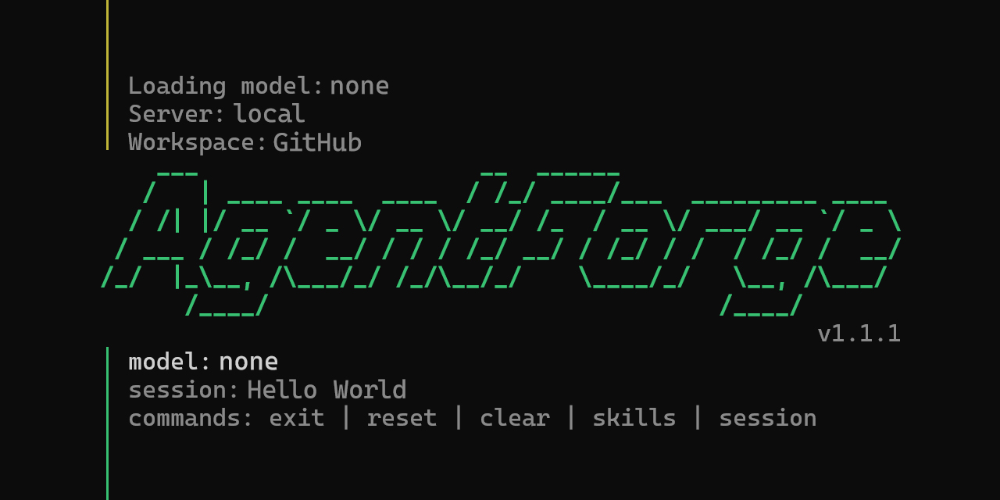
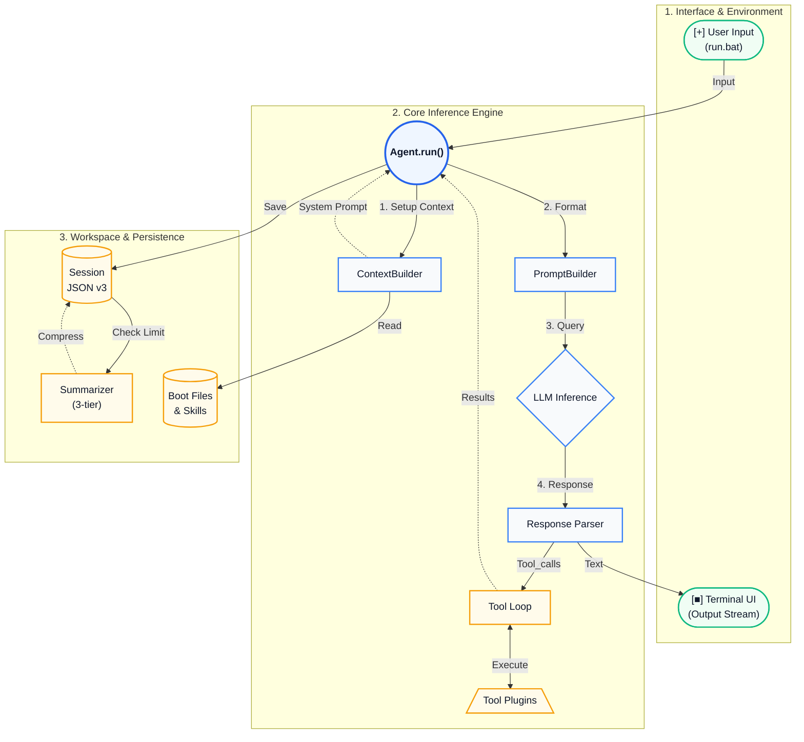

<p align="center">
  
</p>

# [■] Agent-01: Offline Agent Runtime

Agent-01 is a Windows-first AI agent runtime designed to be **100% offline** and privacy-focused, empowering your personal computer with Large Language Models (LLMs).

> **Version:** 1.1.1 · Python 3.10+ · Windows-first · Single launcher: `run.bat`

## [■] Ready to be Re-built

**This is not just a software application; it's a modular toy designed for the AI era.** 
Agent-01 was 100% generated, designed, and maintained by AI. The codebase is deliberately structured to be "AI-friendly." I encourage you to open this project in modern AI IDEs (like VSCode + Antigravity, Cursor, Windsurf, etc.) and ask the AI to read, understand, expand, or completely rewrite any module you want. You are holding a framework—a skeleton. It is up to you and your AI to give it flesh and blood.

---

## [■] System Requirements

*Tested and optimized for mid-range gaming and productivity rigs:*

*   **OS**: Windows 11
*   **CPU**: Intel Core i7 10th Gen (or AMD equivalent)
*   **RAM**: 32GB
*   **GPU**: NVIDIA RTX 3070 Ti (or equivalent with sufficient VRAM for GGUF models)
*   **Storage**: Fast NVMe SSD recommended

---

## [+] Quick Start

1. Install **Python 3.10+** (Node.js optional).
2. Download **llama-server.exe** at: https://github.com/ggml-org/llama.cpp/releases and extract it to the `llama-server` directory of the project.
3. Configure the environment following [Tutorial (EN)](docs/TUTORIAL_EN.md) or [Tutorial (VI)](docs/TUTORIAL_VI.md).
4. Double-click `run.bat`.

> **Note:** `run.bat` is the single entry point. It automatically checks and installs dependencies, loads environment parameters, and launches the runtime.
> **Tip:** Put machine-specific overrides (for example `MODEL_PATH`) in `run.local.bat` to keep local paths out of git history.

---

## [*] Architecture & Data Flow



---

## [*] Two Modes (Provider)

*   **Offline mode** (`set PROVIDER=local`): Default. Runs 100% offline directly on your hardware using `llama-server.exe` with a GGUF model.
*   **Online mode** (`set PROVIDER=openai_compatible`): Uses external cloud compute to call LLMs via APIs (e.g., OpenAI, Anthropic, Google).

---

## [!] Security & Sandbox

*   **Default sandbox (`SHELL_WORKSPACE_ONLY=1`)**: The agent is locked in the `./workspace` directory. Modifying files outside this directory is strictly blocked.
*   **Desktop control (`AGENTFORGE_DESKTOP_CONTROL=1`)**: Native desktop control tools (`desktop_*`) via the `computer-use-agents` skill are enabled by default for maximum PC capability.
*   **Anti-loop Guards**: Strict tool execution loops (`MAX_ITERATIONS`, `MAX_REPEATS`, `AGENT_TIMEOUT`) are wired directly from the launcher to prevent runaways.

---

## [>] Documentation

Explore the documentation for configuration and architectural deep dives:

*   [Tutorial User Guide (EN)](docs/TUTORIAL_EN.md) | [Hướng dẫn Sử dụng (VI)](docs/TUTORIAL_VI.md)
*   [Blueprint Architecture (EN)](docs/BLUEPRINT_EN.md) | [Kiến trúc Hệ thống (VI)](docs/BLUEPRINT_VI.md)

---

## [>] Quality Checks & Tests

```powershell
python -m pytest -q
python -m compileall -q src
$env:PYTHONPATH='src'; python -m agentforge.cli --help
```

---

## [>] Roadmap (Future Versions)

*   **1.2** - Complete Photoshop utilization capabilities.
*   **1.3** - Complete session management features.
*   **1.4** - Calling & receiving data from external APIs/ Access Tokens (Google, Telegram, Zalo, Facebook, Discord, etc.)
*   **2.0** - Add image generation module (dual config online & offline).
*   **2.1** - Upgrade long-term memory.
*   **2.2** - Full automation via chat applications supporting chatbot creation.

---

## [Ω] Credits & Special Thanks

Agent-01 would not exist without the following tools, platforms, and AI systems:

*   **Design Pattern References**: PicoClaw (Go) & OpenClaw (TypeScript).
*   **AI Development Partners**: Google Gemini 3 & 3.1, Anthropic Claude Opus 4.6, OpenAI Codex 5.3.
*   **Development Environment**: Visual Studio Code, Antigravity by Google DeepMind.
*   **Third-Party Modules**: adb-mcp by Mike Chambers (MIT License), `llama.cpp` by Georgi Gerganov, and open-source models by Meta (Llama).
*   **Open-Source Community**: The broader open-source AI agent community.

> *A completely modular project, 100% generated and maintained by AI.*
